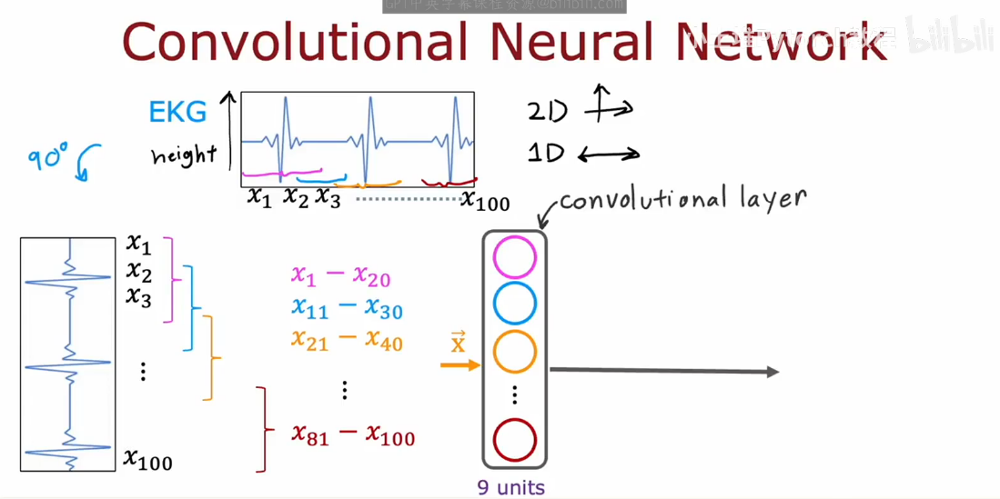

# Additional layer types

Dense Layer

Each neuron output is a function of all the activation outputs of the **previous layer**

some of neural network may choose to use a different type of Layer,

such as **Convolutional Layer（卷积层）**

## Convolutional Neural Network

