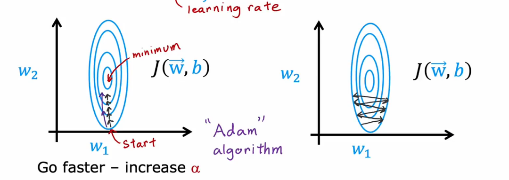
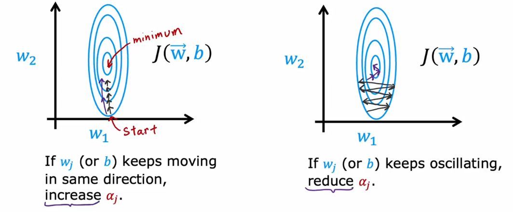

# Advanced Optimized

## Gradient Descent
$w_j = w_j - \alpha \frac{\delta}{\delta w_j}J(\vec w, b)$

if you want Go faster - increase **$\alpha$**

if you want Go faster - decrease **$\alpha$**

**Adam Algorithm Intuition**(Adaptive Moment estimation) can adjust the learning rate automatically

