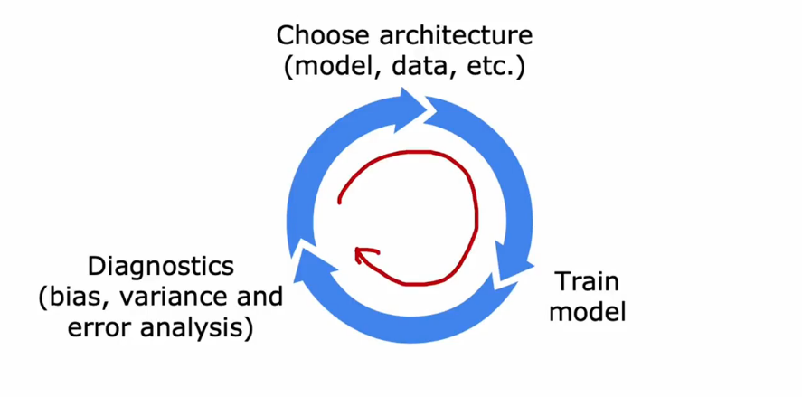
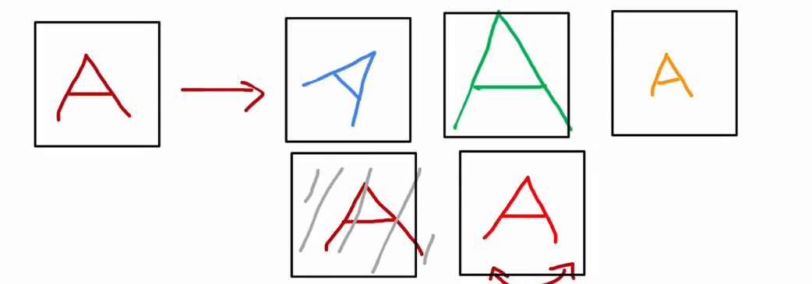
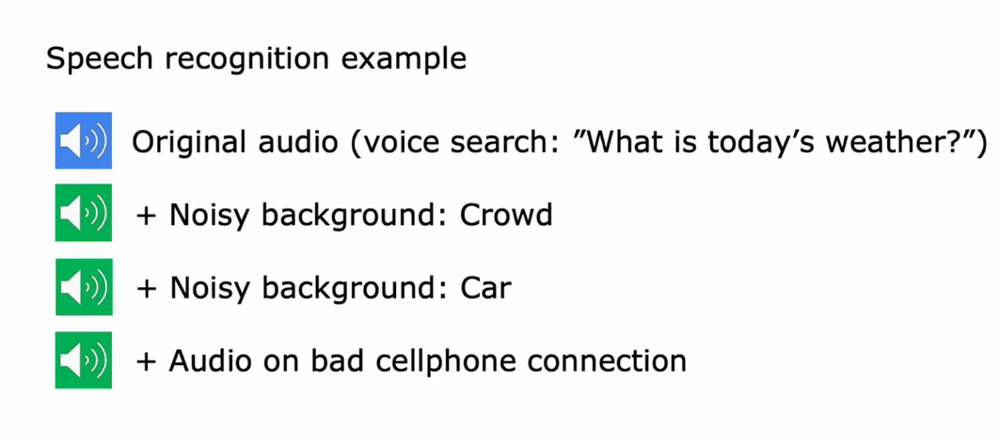
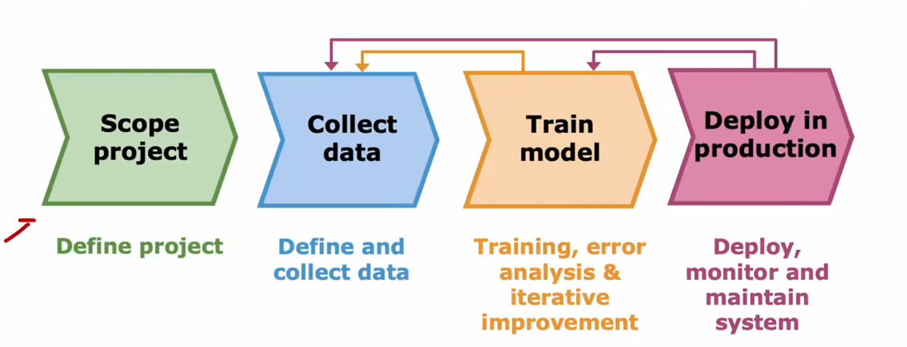
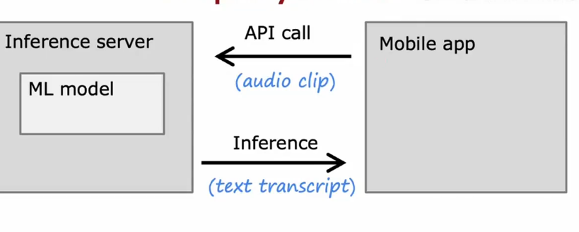
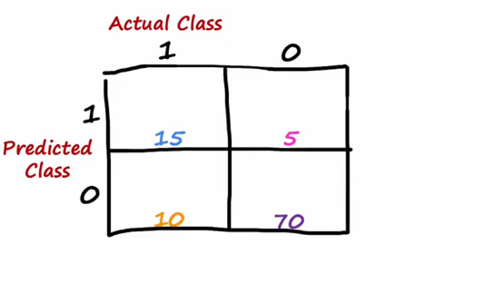
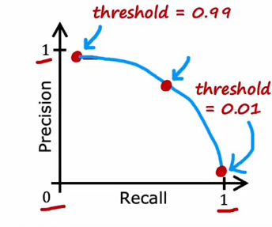

# Iterative loop of ML development

# Error analysis
$m_{cv} = 500$ examples in cross validation set.
Algorithm misclassifies 100 of them.
Manually examine 100 examples and categorize them based on common traits.
1. Pharma(制药公司):
2. Deliberate misspellings(w4tches, med1cine):
3. Unusual email routing:
4. Steal password(phishing):
5. Spam message in embedded image

# Adding data

Add more data of everything. E.g., ***"Honeypot" project.***
Add more data of types where error analysis has indicated it might help.
Beyond getting brand new training examples (x,y),
another technique:**Data augmentation（数据增强）**

## Data augmentation
Augmentation: modifying an existing training example to create a new training example

Data augment speech

## Engineering the data used by your system
**Conventional model-centric approach**: **AI = Code(algorithm/model) + Data**
(Work on Code, focus on improving the code)
**Data-centric-approach**:**AI = Code(algorithm/model) + Data**
(Work on Data, focus on data)

# Full cycle of a machine learning project

if you training a ML model, implement it in a server, which I'm going to call an **inference server**, whose job it is to call your machine learning model, your trained model, in order to make predictions, Then if your team has implemented a mobile app, say a search application, then when a user talks to the mobile app, **the mobile app can the make an API call to pass to your inference server**

THIS IS CALLED: **API application inference**

# Error metrics for skewed datasets(倾斜数据集的错误指标)

Train classifier $f_{\vec w,b}(\vec x)$
(y = 1 if disease present else y = 0)
Find that you've got 1% error on test set (99% correct diagnoses)
**But Only 0.5% of patients have the disease**

## Precision/recall (精确率/召回率)
y = 1 in presence of rare class we want to detect

|Actual Class|Predicted Class|name|
|---|---|---|
|1|1|True positive(真阳性)|
|0|0|True negative(真阴性)|
|0|1|False positive|
|1|0|False negative|

**Precision**:
(of all patients where we predicted y = 1, what fraction actually have the rare disease?)
$\frac{True positives}{\# predicted positive} = \frac{True positives}{ True pos + False pos}$
so in this example $\frac{15}{15 + 5} = 0.75$

**Recall**
(of all patients that actually have the rare disease, what fraction did we correctly detect as having it?(我们正确检测出了多少比例?))

$\frac{True positives}{\# actual positive} = \frac{True positives}{ True pos + False neg}$
so in this example $\frac{15}{15 + 10} = 0.6$

## Trading off precision and recall
Logistic regression: $0 < f_{\vec w,b} < 1$
Predict 1 if $f_{\vec w,b}(\vec x) >= 0.5$ else 0

Suppose we want to predict y = 1(rare disease)
only if very confident.
you can raising this threshold:
Predict 1 if $f_{\vec w,b}(\vec x) >= 0.7$ else 0
**higher precision, lower recall**

Suppose we want to avoid missing too many case of rare disease(when in doubt predict y = 1)
you can lowering this threshold:
**lower precision, higher recall**

More generally predict 1 if:$f_{\vec w, b}(\vec x) >= threshold$

## F1 score
How to compare precision/recall numbers?

**$F_1score = \frac{1}{\frac{1}{2}(\frac{1}{P}+\frac{1}{R})} = 2\frac{PR}{P+R}$**
Harmonic mean
||Precision(P)|Recall(R)|F1 score|
|---|---|---|---|
|Algorithm 1|0.5 |0.4|0.444|
|Algorithm 2|0.7 |0.1|0.175|
|Algorithm 3|0.02|1.0|0.0392|
