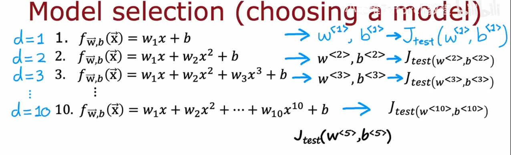
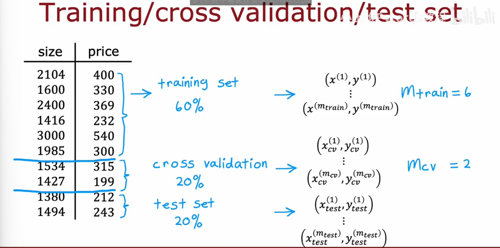
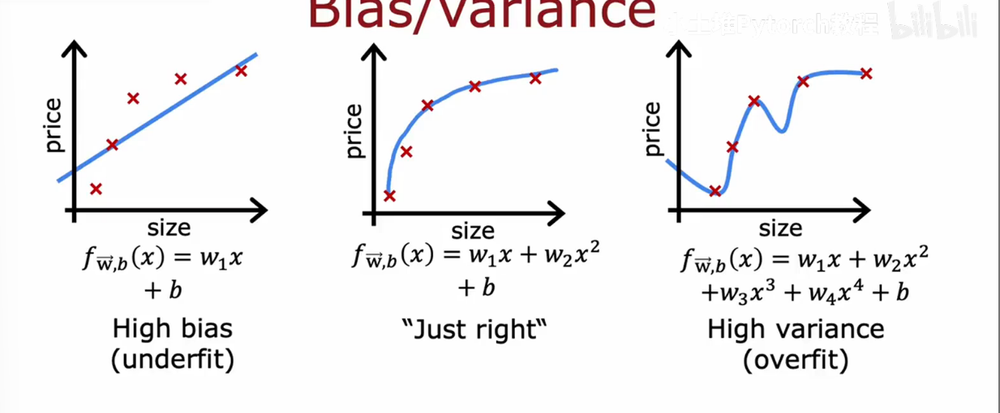
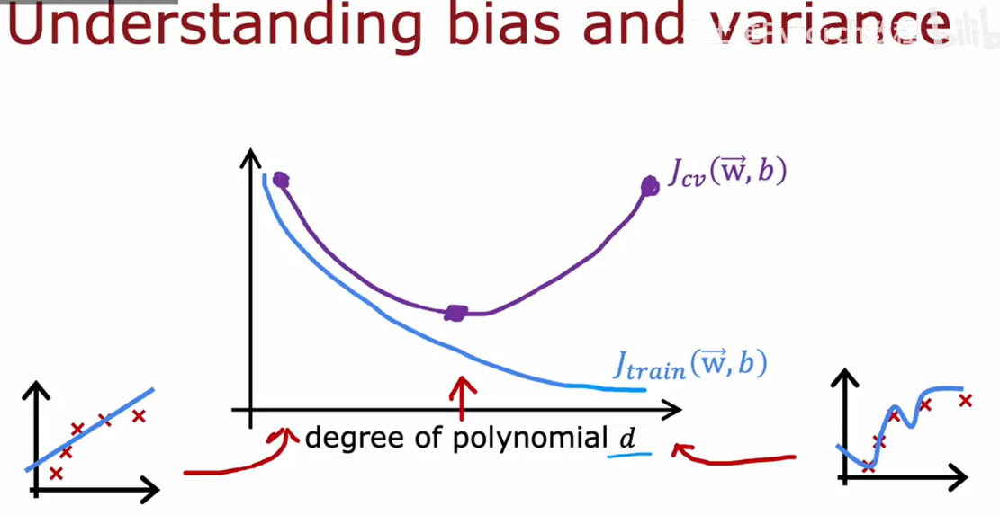
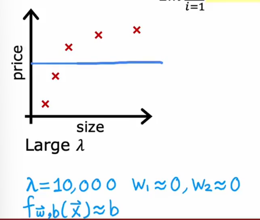
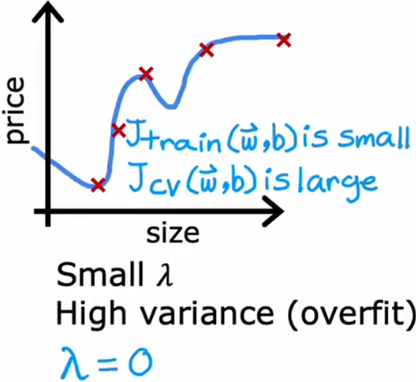
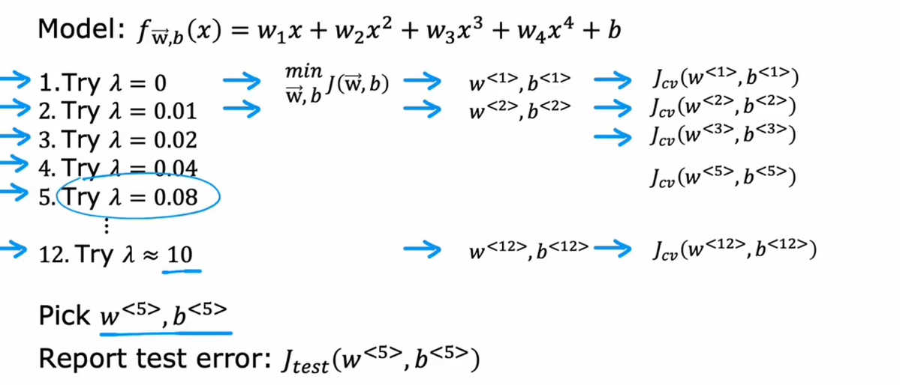
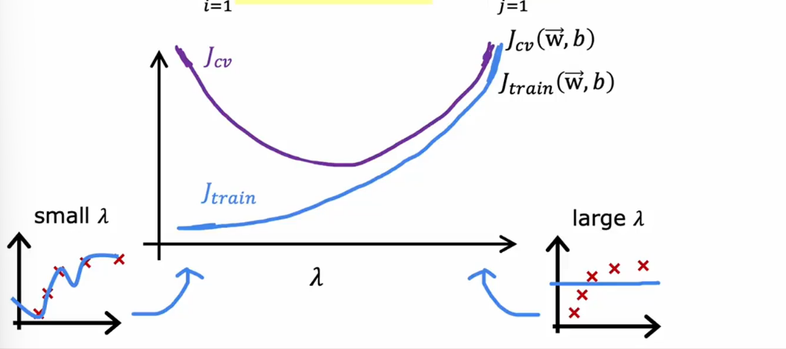
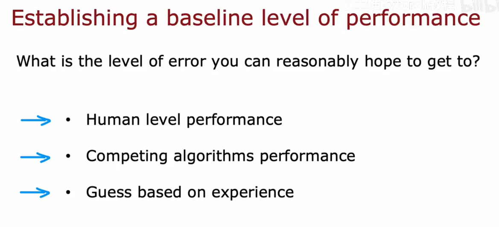
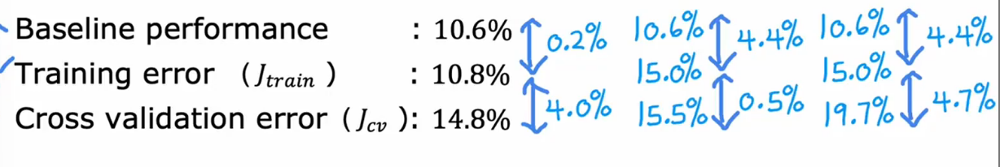

# Model selection (choosing a model)

you can choose a model in d = [1,10], use $J_{\text text}(w^{<d>}, b^{<d>})$
see which one give you the lost values. seen you find that J tests for the fifth-order polynomial for W5, B5
, turns out to be the lowest 

**The Problem**:$J_{\text text}(w^{<d>}, b^{<d>})$ is likely to be an **optimistic estimate** of generalization error. Because an extra parameter **d** (degree of polynomial) was chosen using the test set.

w, b are overly optimistic estimate of generalization erroe on training data
**(如果只看d的话只能说明d在这份数据上泛化能力可以而已)**

to solve this problem, we split this data into **three** different subsets , which we're going to call the **training set**, the **cross-validation(交叉验证集)** set and then also the test.

ps: cross validation = validation(验证集) = development set(开发集) = dev set

# Diagnosing bias and variance

High bias (underfit)
-> $J_{train}$ will be high ($J_{train} \approx J_{cv}$)

High variance(overfit)
-> $J_{cv} >> J_{train}$($J_{train}$ may be low)

High bias and high variance J_{train} will be high and $J_{cv} >> J_{train}$

# Regularization and bias/variance

Model : $f_{\vec w, b}(x) = w_1x + w_2x^2 + w_3x^3 + w_4x^4 + b$
$J(\vec w, b) = \frac{1}{2m}\sum_{i = 1}^{m}(f_{\vec w,b}(\vec x^{(i)}) - y^{(i)})^2 + \frac{\lambda}{2m}\sum_{j=1}^{n}w_j^2$

let start with the example of setting lambda to be very large value, say lambda is equal to **10,000**

^ High bias

^ High variance

## Bias and variance a function of regularization parameter $\lambda$

#
这块就用中文简单说明一下，简单来说使用一个基准值来评估模型是很重要的，（比如声音数据在人类的表现中也会有很大的噪音数据这就会导致人类也会有比较高的偏差）

上图就能看出来哪些是具有高偏差的数据