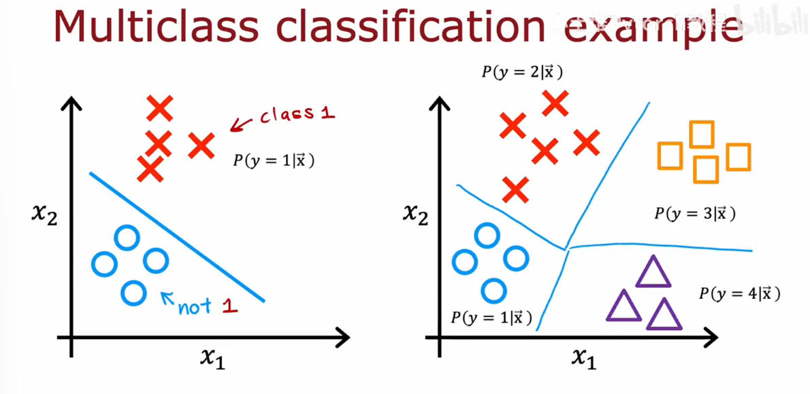
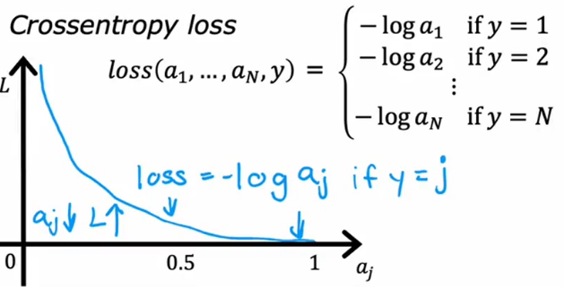

# Multiclass classification example

# Softmax

## Logistic regression(2 possible output values)

$z = \vec w \cdot \vec x + b$
$a_1 = g(z) = \frac{1}{1+e^{-z}} = P(y = 1|\vec x)$
$a_2 = 1 - a_1 = P(y = 0| \vec x)$

## Softmax regression (4 possible outputs)
$z_1 = \vec{w_1} \cdot \vec x + b_1$
$a_1 = \frac{e^{z_1}}{e^{z_1} + e^{z_2} + e^{z_3} + e^{z_4}} = P(x = 1|\vec x)$

$z_2 = \vec{w_2} \cdot \vec x + b_1$
$a_2 = \frac{e^{z_2}}{e^{z_1} + e^{z_2} + e^{z_3} + e^{z_4}} = P(x = 2|\vec x)$

$z_3 = \vec{w_3} \cdot \vec x + b_1$
$a_3 = \frac{e^{z_3}}{e^{z_1} + e^{z_2} + e^{z_3} + e^{z_4}} = P(x = 3|\vec x)$

$z_4 = \vec{w_4} \cdot \vec x + b_1$
$a_4 = \frac{e^{z_4}}{e^{z_1} + e^{z_2} + e^{z_3} + e^{z_4}} = P(x = 4|\vec x)$

## Cost
||Logistic regression|Softmax|
|---|---|---|
|$a_1$|$g(z)=\frac{1}{1 + e^{-z}} = P(y = 1\|\vec x)$|$a_1 = \frac{e^{z_1}}{e^{z_1} + e^{z_2} + ... + e^{z_N}} = P(y = N\|\vec x)$
|loss|$-y\log(a) + (1-y)\log(a)$|

