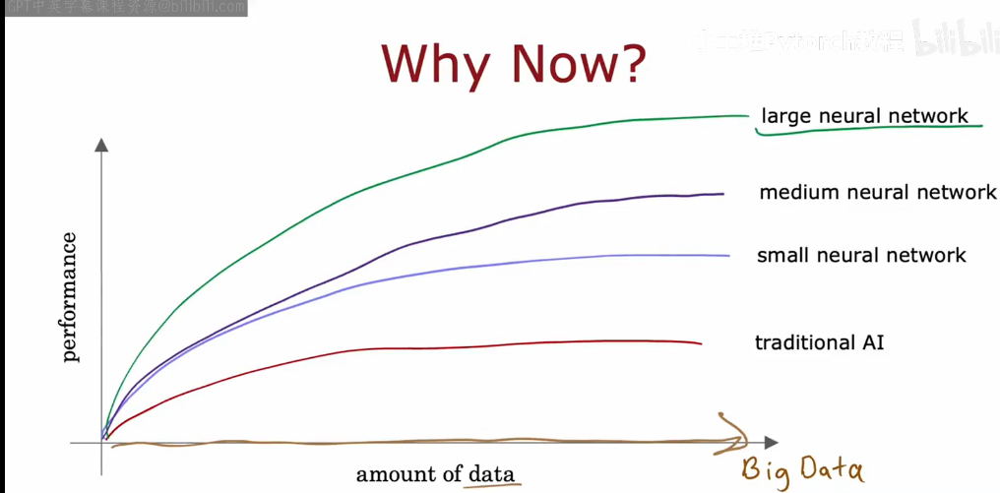

# Neurons and the brain

Let's start by taking a look at how the brain works and how that relates to neural networks.
Origins: Algorithms that try to mimic the brain.

Used in the 1980's and early 1990's.Fell out favor in the late 1990's

**speech -> images -> text(NLP) ->**

## Why Now?
