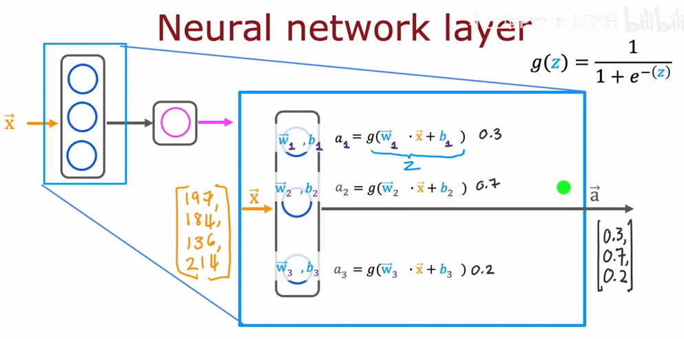
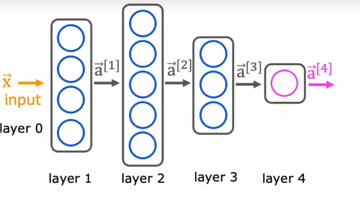
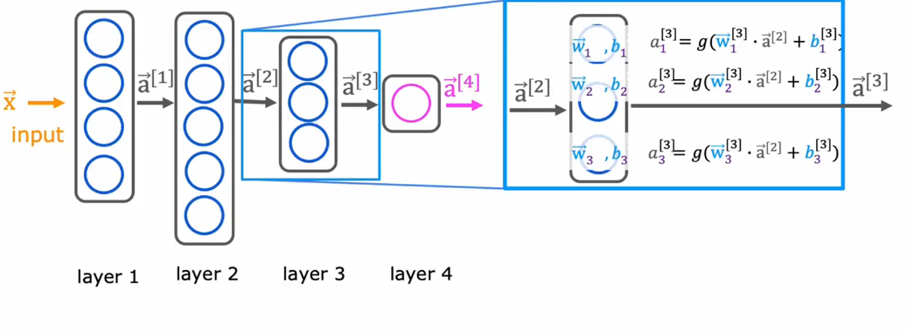
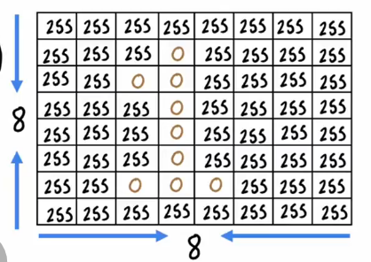

# Neural network layer

because of the three nerual are in layer 1,so that every nerual(the small logistic regression unit) called:
$a_1^{[1]} = g(\vec w_{i}^{[1]} \cdot \vec x + b^{[1]}_{i})$
a is called activation
$\vec w_{i}^{[1]},b^{[1]}_{i}$ is the logistic regression parameters

and in layer2, **the layer 1's output will be the layer2's output**.
Once the neural network has computed a2, there's one final optional step that you can choose to implement or not which is if you want a **binary prediction**.
you can make your therhold to 0.5, if $a^{[2]} >= 0.5$ return $\hat y = 1$ else $\hat y = 0$

So that's how nerual network works,Every layer inputs a vector of numbers and applies a bunch of logistic regression units to it, and then computes another vector of numbers that then gets passed from layer to layer finally output the result.

# More complex neural networks

this is the running example of a more complex neural network.
This network have **four layers** except layer 0.
1,2,3 are hidden layers,and layer 4 is the output layer

Let's see the **compute of layer 3**

and output is a vector contain the result $a_1^{[3]}$,$a_2^{[3]}$,$a_3^{[3]}$

# Inference making predictions(forward propagation)

Example: Handwritten digit recognition

in this example the layer 1 has 25 units,
layer 2 has 15 units,
and layer 3 (also output layer) has 1 units.
the result is : "**probability of being a handwritten '1'**"

because of the algorithm is compute $a_1$ then $a_2$ then $a_3$, so this algorithm also called **forward propagation** because you're propageting the activations of neurons 