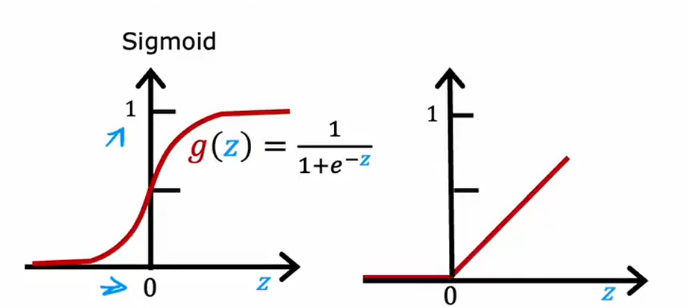
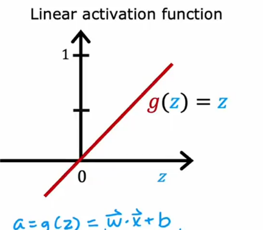
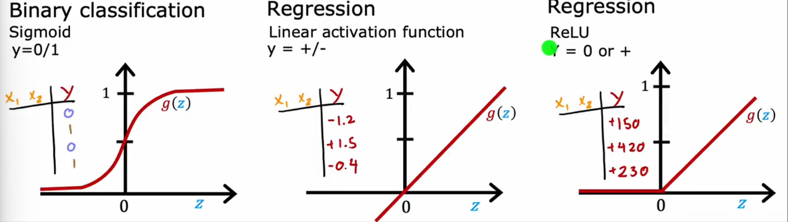
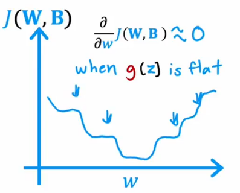
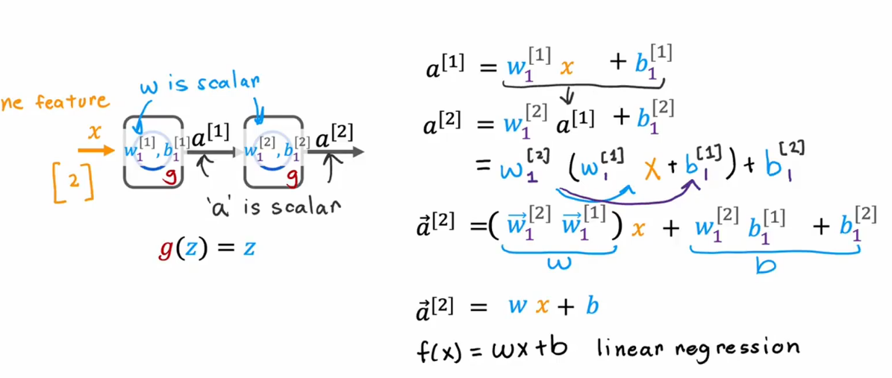

# Alternatives to the sigmoid activation
example:
where given price, shipping cost marketing material, you would try to predict, if something is highly affordable, if there's good awareness, and high perceive quality etc. and based on that try to predict if it's a seller(畅销).

But this assumes that awareness is maybe binary, as either people are aware or they are not. but it seems like the buyer are aware of the t-shirt you're selling may not be binary, they could be just aware or very aware.

the **sigmoid** is always 0 or 1, but in this example, "awareness" will not be in [0, 1], it can be a 0 down or a very large number.

at the right of the **"Sigmoid"**, this activation is called **"ReLU"**, equaltion is:
$g(z) = max(0,z)$
as you can see, **if z < 0 g(z) is 0 else z**

another most commonly used activation function is **Linear activation function**, just $g(z) = z$

# Choosinig activation functions 

### Output layer
if you want to solve a Binary classifcation, you will choose **"Sigmoid"** activation function cause it will output 0/1, and if you want to solve a regression problem you will choose another activation function (**"Linear activation function"**)

in some regression problem, such as House Price prediction, there are not negative values. so you will choose **ReLU**.

### Hidden Layer
now most common choice is **"ReLU"** but not **"Sigmoid"**,
there is a few reasons:
1. **"Sigmoid"** is slow
2. **ReLU** in the gradisent is fast. "Sigmoid" at $+\infty$ and $-\infty$ is flat, that cause $J(W,B)$ is like:

that will make your model learning slowly.

# Why do we need activation functions

if we choose **"Linear function"** to be the activation function in every layer(Hidden and Output), this neutral network will be worked as a Linear Regression, but if you use **"Sigmoid"** to be the function in Output Layer, the network will be worked as a Logistic regression.