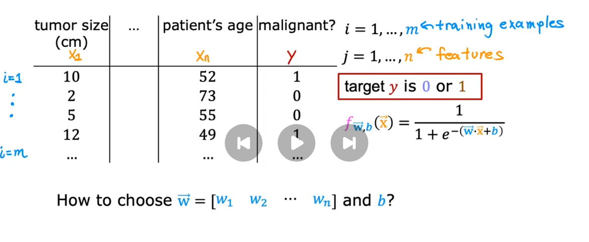
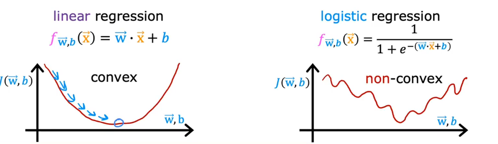
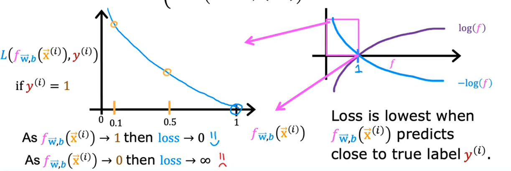
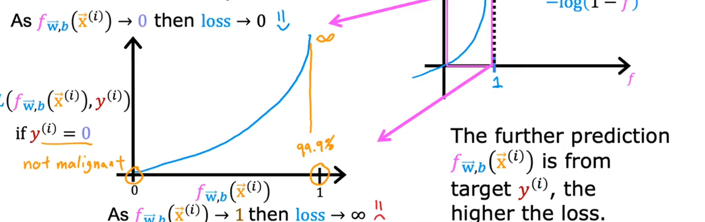

# Cost function for Logistic Regression
the logistic Regression Training Set is like this: 

Now we want to choose $\vec w = [w_1,w_2...,w_n]$ and $b$

if you use gradient descent like linear regression,it could not convengence. and what this means is that if you were to try to use *GD*, there are lots of local minimum.

In order to build a new cost function, one that we'll use for logistic regression, I'm going to change a little bit the defintion of the cost function *J* of *W* and *B*

$J(w,b)=\frac{1}{m}\sum_{i=1}^{m}\frac{1}{2}(f_{\vec w,b}(x^{(i)}) - y^{(i)})^2$
$loss[L(f_{\vec w, b}(\vec x^{(i)}),y^{(i)}]$

we going to denote the loss via this capital L and I'm going to denote the loss via this capital L and is a function of prediction of the learning algorithm, $f(x)$ as well as the true label *y*

## logistic loss function
$
L(f_{\overline{w},b}(\vec{x}^{(i)}), y^{(i)}) = 
\begin{cases} 
-\log\left(f_{\overline{w},b}(\vec{x}^{(i)})\right) & \text{if } y^{(i)} = 1 \\ 
-\log\left(1 - f_{\overline{w},b}(\vec{x}^{(i)})\right) & \text{if } y^{(i)} = 0 
\end{cases}$

## Simplified_Cost_Function
$L(f_{\overline{w},b}(\vec{x}^{(i)}), y^{(i)}) = -y^{(i)}\log(f_{\overline{w},b}(\vec{x}^{(i)}))-(1-y^{(i)})\log(1-f_{\overline{w},b}(\vec{x}^{(i)}))$

$J(\vec w,b)=-\frac{1}{m}\sum_{i=1}^{m}[y^{(i)}\log(f_{\overline{w},b}(\vec{x}^{(i)}))+(1-y^{(i)})\log(1-f_{\overline{w},b}(\vec{x}^{(i)}))]$

this cost function is derived from statistics using a statistical principle called maximum likelihood estimation(最大似然估计), which is an idea from statistics on how to efficiently find parameters for different model.