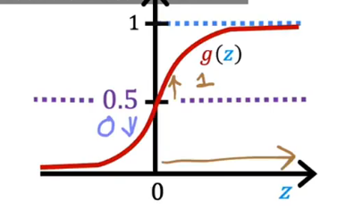
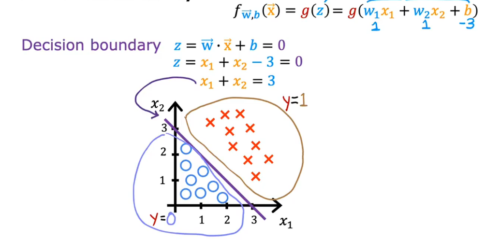
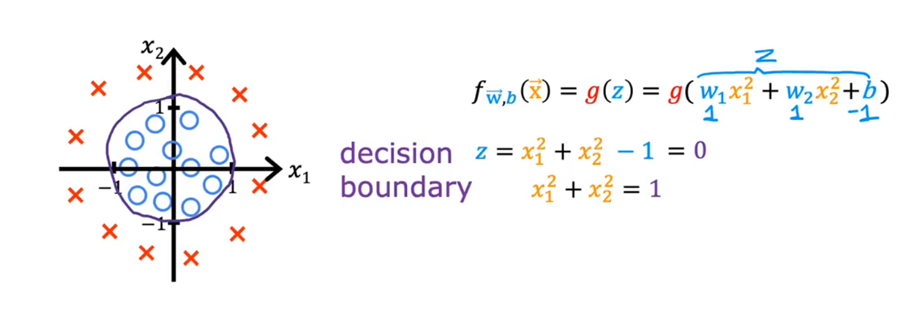

# Decision Boundary
Now, what if you want the learning algorithm to predict,is the value of y going to be 0 or 1?

one thing you might do is set a **threshold** above which you predict $\hat y$ is 1 and below $\hat y$ is 0

So a common choice is, **choose 0.5 to be threshold**

When is $f_{\hat w,b} >= 0.5$?
$g(z) >= 0.5$
that means z>=0(look at the figure)

$\vec{w} \cdot \vec{x} + b >= 0$
$\hat y = 1$
and $\vec{w} \cdot \vec{x} + b < 0$
$\hat y = 0$

we choose $w_1 = 1, w_2 = 1, b = -3$
so that let $z = 0$
$z = x_1 + x_2 = 3$
this is the **threshold**
when the $x_1 + x_2 < 3,g(z) = 0$ and $x_1 + x_2 > 3,g(z) = 1$ 
