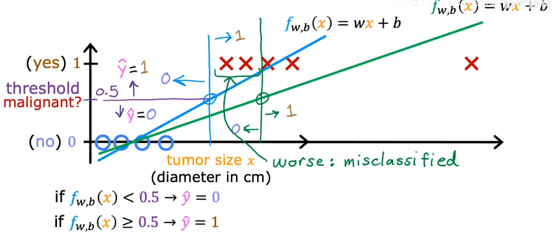

# Motivation
It turns out that **Linear Regression** is not a good algorithm for classification problems
let's look why, and this take us into a different algorithm called **logitic regression**

Question|Answer "y"
---|---|
Is this email spam?|no yes
Is the transaction fraudulent?|no yes
Is the tumor malignant?|no yes

*y* can only be one of two values
this called **"binary classification"**
False = 0
True = 1

if we use linear regression ,we will training a bad model like this 