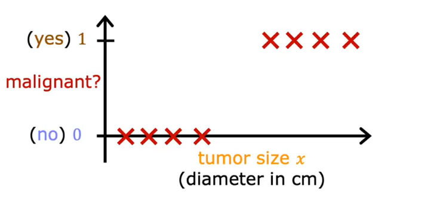
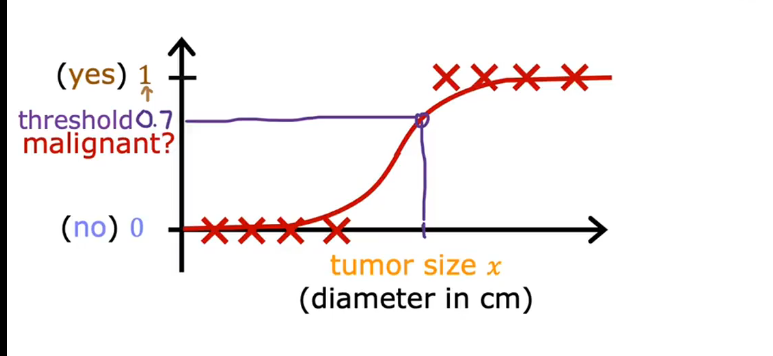
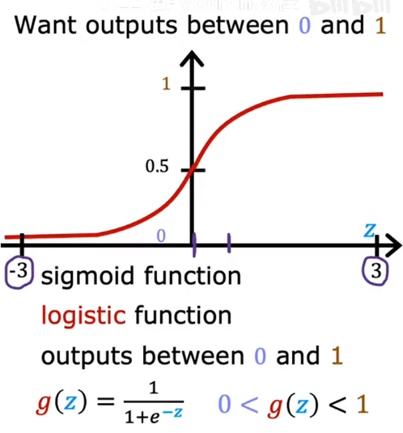

# logistic_Regression
Here's a graph of the data set where the horizontal axis is the tumor size and the vertical axis takes on only values of 0 and 1 because it's a classfication program.

but we want outputs **between 0 and 1**
to bulid the logistic_Regression, there is a important mathematical function I'd like to describe,which is called the **sigmoid function**,sometimes also referred to as the **logistic function**

you see 
$g(z) = \frac{1}{1+e^{-z}}$ $0< g(z) < 1$
this is sigmoid function
and we want to find z:
$f_{\vec{w},b}(\vec x) = \vec w \cdot \vec x + b$
let $z=\vec w \cdot \vec x + b$

when you take these two equations and put them together,
they then give you the logistic regression model $f(x)$
$f_{\vec{w},b}(\vec x) = g(\vec w \cdot \vec x + b)$

**this is the logistic regression model**

# Interpretation of logistic regrssion output
$f_{\vec{w},b}(\vec x)=\frac{1}{1+e^{-(\vec w \cdot \vec x + b)}}$

Example:
*x* is "tumor size"
*y* is 0 (not malignant) or 1(malignant)
$f_{\vec{w},b}(\vec x)=0.7$
$70\%$ chance that y is 1