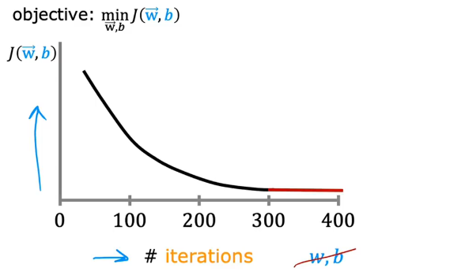

# Checking Gradient Descent for Convergence

is **Gradient descent** helping you to find parameters close?\
By learning to **recognize** what a well-running implementation of gradient descent looks like

## Gradient descent

$\begin{cases}
w=w-\alpha\frac{d}{dw}J(\vec{w},b) \\
b=b-\alpha\frac{d}{db}J(\vec{w},b)
\end{cases}$

horizontal axis is **the number of iterations** not w or b

$J(\vec{w},b)$ should **decrease** after every iteration

at 300 iterations the j is leveling off and not longer decreasing much.

this means Gradient Descent is **Convergence**
make this figure can help you judge to stopping iteration in which time.

another way is with an **automatic convergence test**
## automatic convergence test
Let $\epsilon$ be $10^{-3}$
If $J(\vec{w},b)$ decreases by $\leq \epsilon$ in one iteration,
declare convergence
(found parameters $\vec{w},b$ to get close to global minimum)
