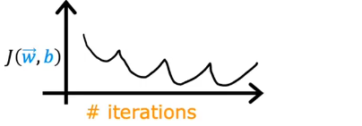
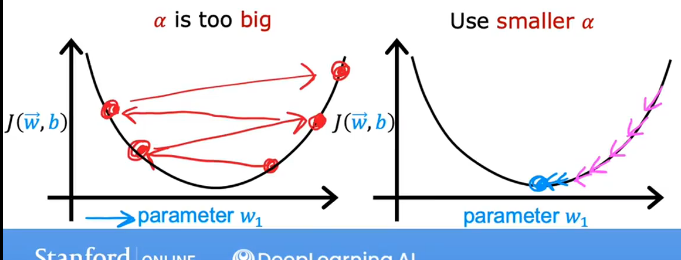
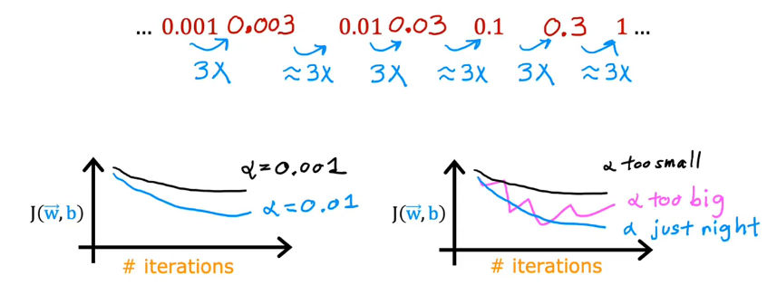

# Choosing the Learning Rate

**Learning Rate**, if it's too large ,it may not even converge,
if it's too small,it may run very slowly.

## Identify problem with gradient descent
Concretely, if you plot the cost for a number of iterations, and notice that the cost sometimes goes up and sometimes goesdown, you should clearing take sign that gradient descent is not working properly.This could mean **bug in code** or sometimes it could mean that **your learning rate is too large**

here is a illustration of what might be happening

If $\alpha$ is too small, gradient descent takes a lot more iterations to converge, **but it is correct,so you can use a small $\alpha$ to DeBug your program, if J not decrease, that means your program have Bug**
With a small enough $\alpha$, J should decrease on every iteration.

Values of $\alpha$ to try:
