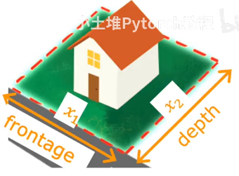

# Feature Engineering

$f_{\vec{w},b}(\vec{x})=w_1x_1+w_2x_2+b$

$x_1:frontage$
$x_2:depth$
$area = frontage * depth$
$x_3 = x_1x_2$ (new feature)
and you will have a new equaltion
$f_{\vec{w},b}(\vec{x})=w_1x_1+w_2x_2+w_3x_3+b$

Feature engineering:
Using **intuition (or knowledge)** to design **new features**, by transforming or combining original features.