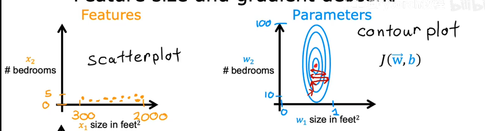
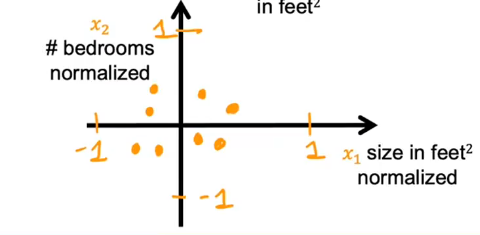
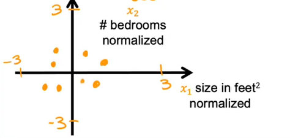
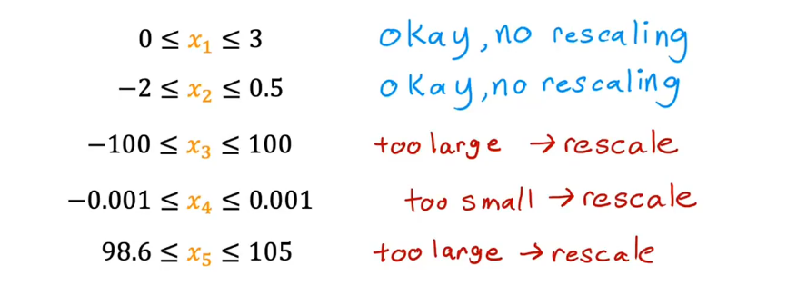

# Feature Scaling
Feature scaling is a techniche that make gradient descent work much better

$\hat{price}=w_1x_1+w_2x_2+b$

$x_1$ = size($feet^2$)\
range:300 - 2,000

$x_2$ = bedrooms\
range:0 - 5

House:$x_1$ = 2000, $x_2$ = 5, price = \$500k
for this training example what's reasonable values for the size of params $w_1$ and $w_2$?

if:\
$w_1=50,w_2=0.1,b=50$

$\hat{price} = 50*2000 + 0.1*5+50 = 100,050.5$

else if:\
$w_1=0.1,w_2=50,b=50$

$\hat{price} = 0.1*2000 + 5*50+50 = 500$

Because the contours are so tall and skinny, gradient descent may end up bouncing back and forth for a long time before it can finally its way to the global minimum
This is **feature scaling**

# How to scale features?
one way of original is calculate a scaled version of $x_1$ ,$x_2$by taking each original
## Original
$300 \leq x_1 \leq 2000$
$x_{1,scaled} = \frac{x_1}{2000}$
$0.15 \leq x_{1,scaled}\leq 1$

and also\
$x_{2,scaled} = \frac{x_2}{5}$
$0 \leq x_{2,scaled}\leq 1$
## Mean normalization(均值归一化)
you should caculate the average of training set
example $average(x_1)=600$
$300 \leq x_1 \leq 2000$
$x_{1,scaled} = \frac{x_1 - \mu_1}{2000 - 300}$
$-0.18 \leq x_{1,scaled}\leq 0.82$

and also\
$x_{2,scaled} = \frac{x_2-\mu_2}{5-0}$
$-0.46 \leq x_{2,scaled}\leq 0.54$
if you use Mean normalization to $x_1$,$x_2$, the figure is like this

## Z-score normalization
To implement z-score normalization, you need to calculate the std deviation $\sigma$ of each feature
example $x_1$:$\sigma = 450$ $\mu_1=600$
$x_1=\frac{x_1-\mu_1}{\sigma_1}$
$-0.67 \leq x_{1,scaled}\leq 3.1$
also $x_2$
$-1.6 \leq x_{2,scaled}\leq 1.9$
the figure is like this:

**aim for about $-1 \leq x_j \leq 1$ for each feature $x_j$
alse acceptable ranges:**
$-3 \leq x_j \leq 3$
$-0.3 \leq x_j \leq 0.3$
