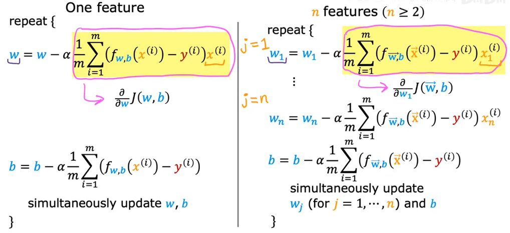

# Gradient_Descent _for_Multiple_Regression

||Previous notation|Vector notation|
|---|---|---|
|Parameters|$w_1,w_2...w_n$|$\vec{w} = [w_1 ... w_n]$|
|Model|$f_{\vec{w},b}(\vec{x})=w_1x_1+...w_nx_n+b$|$f_{\vec{w},b}(\vec{x}) = \vec{w}\cdot\vec{x} + b$|
|Cost function|$J(w_1,...,w_n,b)$|$J(\vec{w},b)$|

# Analternative to gradient descent
Normal equation(正规方程)
- Only for linear regressin
- Solve for w, b without iterations 