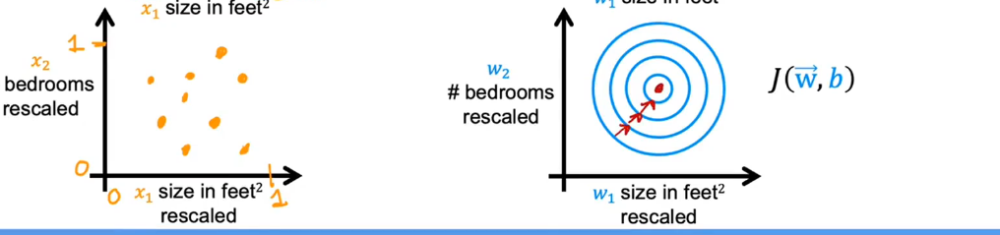

# Multiple features(variables)
In the original version of linear regression, you had a single feature *x* and able to predict *y*
So the model is:
$f_{w,b}(x)=wx+b$
But Now what if you didn't not only have one *x*, It seems give you more information like this

$x_1$ = Size of $feet^2$; $x_2$ = Number of bed rooms... 
$x_j$ = $j^{th}$ feature
$n$ = number of features
$x^{(i)}$ = features of $i^{th}$ training example
$x_j^{(i)}$

Model:
Previously: $f_{w,b} = wx + b$
Now:$f_{w,b} = w_1x_1 + w_2x_2 ... + w_nx_n + b$
$\vec{w} = [w_1,w_2,...,w_n]$
$\vec{x} = [x_1,x_2,...,x_n]$
$b$ is a number

so:
$f_{\vec{w},b}=\vec{w}\cdot\vec{x} + b$

this is called multiple linear regression