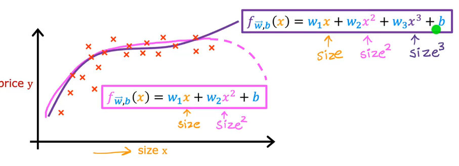

# Polynomial Regression
Take the ideas of **multiple linear regression** and **feature engineering** to come up with a new algoritm called **polynomial regression(多项式回归)**, which lets you fit curves, non-linear functions to your data.
## Choice of features
$f_{\vec{w},b}(x)=w_1x+w_2x^2+w_3x^3 + b$

the first feature is the $size$ and second is the $size^2$ $size^3$\
if use polynomial regression ,the **feature scaling** become very important

