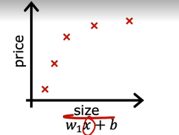
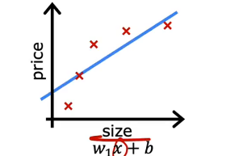
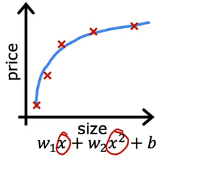
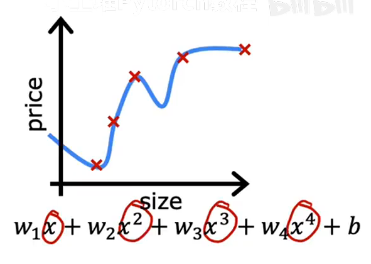
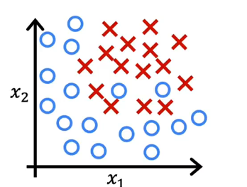
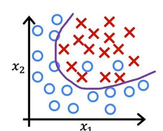
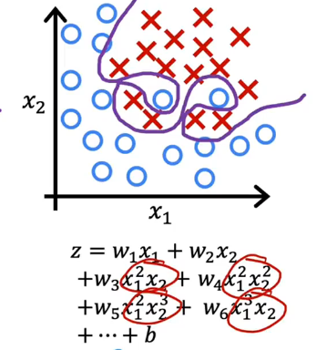
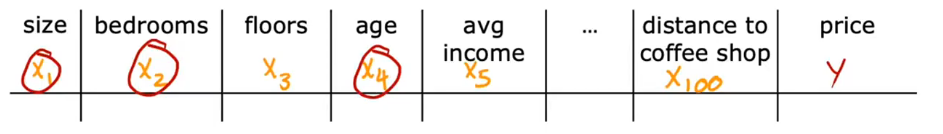
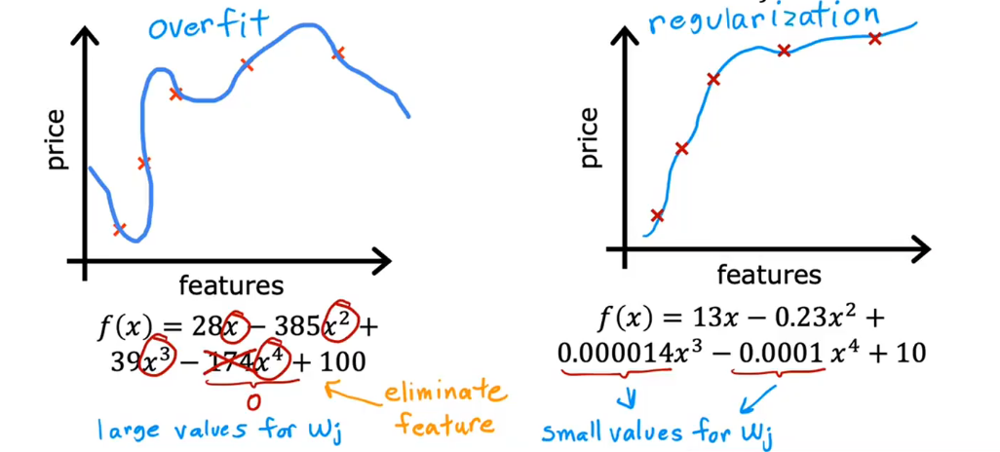

# the problem of overfitting

Let's go back to our original example of predicting housing prices with linear regression, where you want to predict the price as a function of the size of a house.

One thing you can do is use a linear function to fit the data
And if you do that, you get a straight line may like this

**underfit(欠拟合)**
**Doesn't fit the training set well**
Another term is the algorithm has **high bias(高偏差)**(In ML, the term bias has multiple meanings,if the algorithm had underfit the data, meaning that it's just not even able to fit the training set that well)

**just right**
**this fits training set pretty well**
**Generalization(泛化)**

**Fits the training set extremely well**
**Overfit!!!(过拟合)(high variance)(高方差)**
Although this polynomial equation fits all the known data well, its predictive power is poor.

## Similarly,overfitting applies to classifiction as well

if use $z = w_1x_1 + w_2x_2 + b$
$f_{\vec,b}(\vec x) = g(z)$
it just a line and underfitting the data

$z = w_1x_1 + w_2x_2 + w_3x_1^{2} + w_4x_2^{2} + w_5x_1x_2 + b$
**just right**

**Overfitting**

# Addressing Overfitting
the number one tool you can use against overfitting is to **get more training data**

|all features|selected features|
|---|---|
insufficient data|size, bedrooms, age|
overfit|just right feature selection|

## Regularization
**Reduce the size of parameters $w_j$**

Suppose that you have a way to make $w_3, w_4$ really small
More Originally implemented is if you have a lot of features, say 100 features, you may not know which are the most important features and which ones to penalize
So the way regularization is typically implemented is to **penalize all the features(all the $w_j$ parameters)**

$J(\vec w,b) = \frac{1}{2m}\sum_{i=1}^{m}(f_{\vec w,b}(\vec {x}^{(i)})-y^{(i)})^2 + \frac{\lambda}{2m}\sum_{j=1}^{n}w_j^2$

$\min J(\vec w,b) = \min [\frac{1}{2m}\sum_{i=1}^{m}(f_{\vec w,b}(\vec {x}^{(i)})-y^{(i)})^2 + \frac{\lambda}{2m}\sum_{j=1}^{n}w_j^2]$

try to minimize this first term encourages the algorithm to fit the training data well by minimizing the squared differences of the predictions and the actual values.

And trying to minimize the second term, the algorithm also tries to keep the parameters $w_j$ small, which will tend to reduce overfitting
**fit data and keep w_j small, $\lambda \ \text{balances both goals}$**
## Options
- Collect more data
- Select features
  - Feature Selection
- Reduce size of parameters
  - "Regularization"