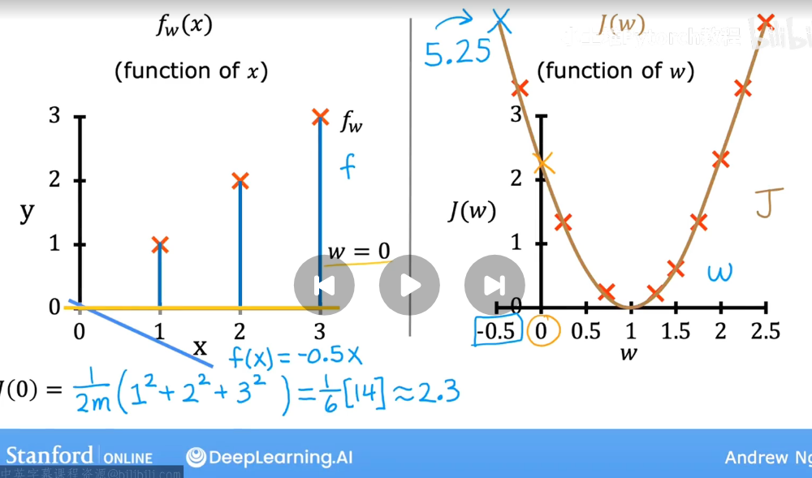

# Model:$f_{w,b}(x) = wx + b$
in machine learning you can **adjust** during training in order to improve the model\
sometimes you will hear $w ,b$to as coefficients(系数) or as weights(权重).

Find $w,b$:
$\hat{y}^{(i)}$ is close to $\hat{y}^{(i)}$ for all ($\hat{y}^{(i)}$,$\hat{x}^{(i)}$)

To answer that question, let's first take a look at how to measure how well a line fits the training data:\
The cost function takes the prediction $\hat{y}$ and compares it to the target y by taking $\hat{y}$ hat minus $\hat{y}$

## cost function
$\frac{1}{m}\sum_{i=1}^{n} (y_i - \hat{y}_i)^2$
- if your *m* is larger and your cost function will calculate a bigger number since it's summing over more examples. So to build a cost function that doesn't automatically get bigger as the training set size gets larger, by convention we will compute the **the average squared error instead of the total squared error** ; and we do that by dividing by *m* like this
- By convention, the cost function that machine learning people use actually divide *2m*:
  $\frac{1}{2m}\sum_{i=1}^{n} (y_i - \hat{y}_i)^2$
So this is the cost function we're going to write ***J*** of ***WB*** to refer to the cost function
$J(w,b)=\frac{1}{2m}\sum_{i=1}^{m}(f_{w,b}(x^{(i)}) - y^{(i)})^2$

our goal is minimize ***J(w,b)***

## simplified model
considered a simplified model like:$f_w(x) = wx$\
cost function is like:
$J(w,b)=\frac{1}{2m}\sum_{i=1}^{m}(f_{w}(x^{(i)}) - y^{(i)})^2$

we try to find w:
- the training set is contain (1,1),(2,2),(3,3)
- use amount of *w* for $J(w)$ to compute cost *f*

choose w to minimize $J(w)$
so *w* = 1
