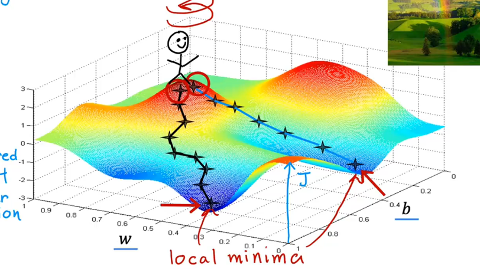

# Gradient Descent

It would be nice if we had a more **systematic way to find the values of w and b that result in small cost w and b**.

It turns out there's an algorithm called **gradient descent** that you can use to do that.

## Have some function $J(w,b)$
## Want $\min\limits_{w,b}J(w,b)$
## Outline: Start with some w,b, Keep changing *w,b* to reduce *J(w,b)*
## Until we settle at or near a minimum (may have > 1 minimum)
In gradient descent, the choice of initial parameters $(w, b)$ can lead to different convergence points. Depending on where we start, the algorithm may arrive at different "valleys" on the loss surface, which correspond to different **local minima**. This means gradient descent is sensitive to initialization.

# Implementing Gradient Descent
$\begin{cases}
w=w-\alpha\frac{d}{dw}J(w,b) \\
b=b-\alpha\frac{d}{db}J(w,b)
\end{cases}$
- in this equation, alpha is also called the **learning rate**(学习率).What alpha does is it basically controls how big of a step you take down hill.So if alpha is very large, then that corresponds to a very aggressive gradient descent procedure, where you're trying to take huge steps downhill.
- "=" is like code, not like "equal" in math
- \frac{d}{dw}J(w,b) is Derivative the cost function j
- Simultaneous update *w,b*: in the coding enviroment correct simultanous update is:
  $tmp\_w = w-\alpha\frac{d}{dw}J(w,b)$
  $tmp\_b = b-\alpha\frac{d}{db}J(w,b)$
  $w = tmp_w$
  $b = tmp_b$
- If $\alpha$ is too small, Gradient descent will work but may be slow.
  If $\alpha$ is too large, Gradient descent may 
  - overshoot, never reach minimum
  - Fail to converge, diverge

# Gradient Descent for Linear Regression
$$
\begin{aligned}
\frac{d}{dw} J(w,b) &= \frac{d}{dw} \left[ \frac{1}{2m} \sum_{i=1}^{m} (f_{w,b}(x^{(i)}) - y^{(i)})^2 \right] \\
&= \frac{1}{m} \sum_{i=1}^{m} (f_{w,b}(x^{(i)}) - y^{(i)}) \cdot x^{(i)}
\end{aligned}
$$
$$
\begin{aligned}
\frac{d}{db} J(w,b) &= \frac{d}{db} \left[ \frac{1}{2m} \sum_{i=1}^{m} (f_{w,b}(x^{(i)}) - y^{(i)})^2 \right] \\
&= \frac{1}{m} \sum_{i=1}^{m} (f_{w,b}(x^{(i)}) - y^{(i)})
\end{aligned}
$$

repeat until convergence {
    $w = w - \alpha\frac{1}{m} \sum_{i=1}^{m} (f_{w,b}(x^{(i)}) - y^{(i)}) \cdot x^{(i)}$
    $b = b - \alpha\frac{1}{m} \sum_{i=1}^{m} (f_{w,b}(x^{(i)}) - y^{(i)})$
}